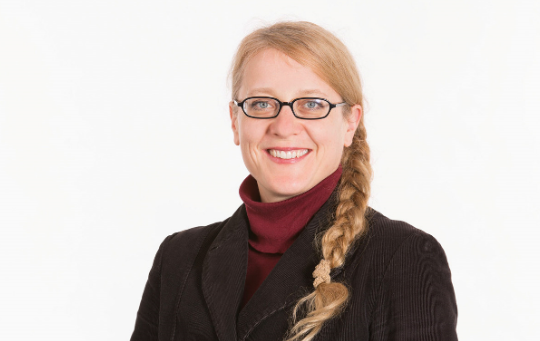

 
<html>
<head>

 

</head>

<body>

<ul>
  <li><a href="http://www.coforce.cl/index.html">Home</a></li>
  <li><a href="http://www.coforce.cl/equipo.html">Equipo</a></li>
  <li><a href="http://www.coforce.cl/quienessomos.html">COFORCE</a></li>
  <li><a href="http://www.coforce.cl/datos.html">Datos</a></li>
  <li><a href="http://www.coforce.cl/resultados.html">Resultados Preliminares</a></li>
  <li><a href="http://www.coforce.cl/publicacion.html">Publicaciones</a></li>
  <li><a href="http://en.coforce.cl/index.html">Inglés</a></li>
  <li><a href="http://ger.coforce.cl/index.html">Alemán</a></li>
  

</ul>

<h1> Anke Mönnig </h1>

<table border="2">
    
<tr>
<td> Área de Investigación:  
 </td>

<td>  Structural change, Labour Market, International Trade, Input-output modelling</td>

<tr>

<td>  Educación:
 </td>

<td>    Diploma in Economics, Free University of Berlin, Germany, 2004. Master of Arts in International Economics, Berlin School of Economics and Law, Berlin, Germany, 2006. 
</td>

</tr>

<tr>
<td>  Contacto: </td>

<td>  moennig at gws-os.com </td>

</tr>

<tr> 
<td >  Sitio Web  </td> 
<td> http://www.gws-os.com/de/index.php/the-gws/team/details/member/22.html   </td>

<tr>
<td> 
 Reseña:  </td>
<td>  
Anke Mönnig ha trabajado como cabeza en la división "Economic and Social Affairs" del centro GWS desde Julio del 2006.Su focus de investigación está concentrado en el análisis industrial, el mercadlo laboral y los cambios estructurales con enfasis en el comercio exterior. Es responsable del desarrollo del modelo aleman INFORGE y del modelo de comercio internacional TINFORGE. Desde el año 2006, Anke Mönnig ha formado parte del equipo del proyecto que trabaja en la evaluación cuantitativa y cualitativa de las industrias en nombre de la "German Savings Bank Association and Publishing Company (DSGV/DSV). Desde los recientes años, ella ha sido activa miembra del QuBe project (www.qube-projekt.de), en que junto a otros colaboradores (BIBB, IAB) la modelación de la oferta y demanda del mercado laboral aleman ha sido promovida. También trabaja en proyectos internacionales (Tunisia, Egipto, Israel) con focus en el modelamiento de rutinas en base al análisis input-output.    
</td>
</tr>
</tr>

</table> 

- <a href="http://www.coforce.cl/equipo.html"> Volver a Equipo </a>

</body>

</html>