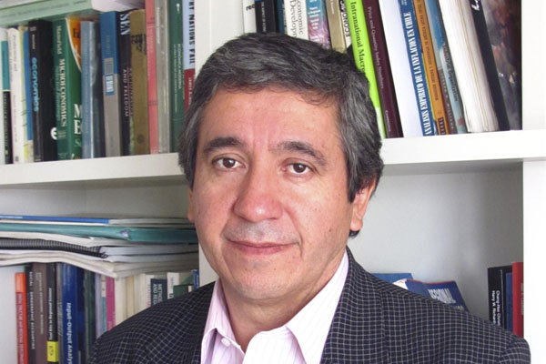

<html>

<head>

</head>

<body>

<ul>
  <li><a href="http://www.coforce.cl/index.html">Home</a></li>
  <li><a href="http://www.coforce.cl/equipo.html">Equipo</a></li>
  <li><a href="http://www.coforce.cl/quienessomos.html">COFORCE</a></li>
  <li><a href="http://www.coforce.cl/datos.html">Datos</a></li>
  <li><a href="http://www.coforce.cl/resultados.html">Resultados Preliminares</a></li>
  <li><a href="http://www.coforce.cl/publicacion.html">Publicaciones</a></li>
  <li><a href="http://en.coforce.cl/index.html">Inglés</a></li>
  <li><a href="http://ger.coforce.cl/index.html">Alemán</a></li>
  

</ul>

<h1> Patricio Aroca </h1>

<table border="2">
<tr>
   
          
</tr>
<tr>
<td> Área de Investigación:  
 </td>

<td>   Economía Regional, Conmutación y Migración Regional, Concentración de Capital Humano, Matrices Input-Output.  </td>

<tr>

<td>  Educación:
 </td>

<td>    Ph. D., Economics, University of Illinois, Urbana-Champaign. United States, 1995. 
Postdoctoral Stage at REAL, University of Illinois, Urbana-Champaign. United States, 2002. 
</td>

</tr>

<tr>
<td>  Contacto: </td>

<td> patricio.aroca@uai.cl </td>

</tr>

<tr> 
<td >  Sitio Web  </td> 
<td> https://sites.google.com/site/parocasitio1/ 
http://cepr.uai.cl/equipo/patricio-aroca-2/ </td>
</tr>

<tr>
<td> 
 Reseña:  </td>
<td> 
Profesor Titular de la Escuela de Negocios, Investigador Responsable del Núcleo de la Iniciativa Científica Milenio de MIDEPLAN "Ciencia Regional y Políticas Públicas" y Profesor investigador afiliado al Laboratorio de Economía Regional Aplicada (REAL) de la Universidad de Illinois, Estados Unidos. Recientemente ha publicado sobre análisis de insumo producto, econometría espacial, crecimiento regional y migración laboral interregional. Desde 1997 a 2000 fue Decano de la Facultad de Economía y Administración de la Universidad Católica del Norte y ha sido consultor del Banco Mundial, Banco Interamericano del Desarrollo (BID), Conferencia de Naciones Unidas para el Comercio y Desarrollo (UNCTAD) y el Centro Latinoamericano de Demografía de Naciones Unidas (CELADE-UN). Es miembro del Consejo de la Comisión Chilena del Cobre (COCHILCO), y pertenece al Directorio de RSAI (Regional Science Association International) y de PRSCO (Pacific Regional Science Council).- 
</td>
</tr>
</tr>

<tr>
<td>  Otras afiliaciones  </td>
<td>  Miembro del Consejo de la Comisión Chilena del Cobre (COCHILCO)
Profesor de investigación en Regional Economic Application Laboratory (REAL), Universidad de Illinois, USA
Presidente Electo: Pacific Regional Science Organisation (PRSCO)  </td>

</tr>

</table> 

- <a href="http://www.coforce.cl/equipo.html"> Volver a Equipo </a>

</body>

</html>