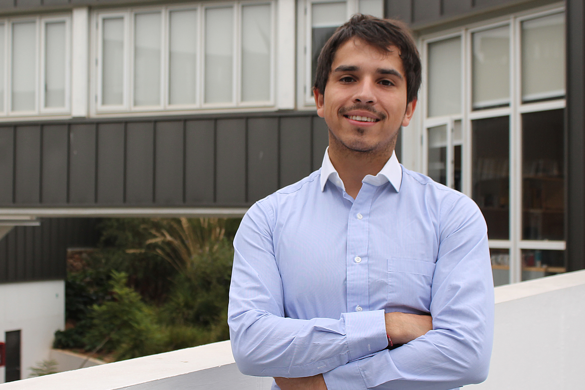

 
<html>

<head>

</head>

<body>
<ul>
  <li><a href="http://www.coforce.cl/index.html">Home</a></li>
  <li><a href="http://www.coforce.cl/noticias.html">Noticias</a></li>
  <li><a href="http://www.coforce.cl/equipo.html">Equipo</a></li>
  <li><a href="http://www.coforce.cl/quienessomos.html">COFORCE</a></li>
  <li><a href="http://www.coforce.cl/datos.html">Datos</a></li>
  <li><a href="http://www.coforce.cl/resultados.html">Resultados Preliminares</a></li>
  <li><a href="http://www.coforce.cl/publicacion.html">Publicaciones</a></li>
  <li><a href="http://en.coforce.cl/index.html">Inglés</a></li>
  <li><a href="http://ger.coforce.cl/index.html">Alemán</a></li>
  

</ul>

<h1> Felipe Morales </h1>     

<table border="2">

<tr>
<td> Área de investigación:
 </td>

<td>  Organización Industrial & Matrices Insumo Producto  </td>

<tr>

<td>  Educación:

 </td>

<td> 
 Magíster en Economía, Universidad Adolfo Ibáñez

</td>

</tr>

<tr>
<td>  Contacto: </td>

<td> f.morales@edu.uai.cl </td>

</tr>
  
<tr> 
<td >  Sitio Web  </td> 
<td>  http://cepr.uai.cl/equipo/felipe-morales/ </td>

<tr>
<td> 
 Reseña:  </td>
<td> 
Felipe Morales actualmente se desempeña como ayudante de investigación en el Centro de Economía y Política Regional (CEPR), trabajando en tópicos relacionados a las matrices input-output, enmarcado en el proyecto de investigación CONICYT-BMBF 150061. Además, se desempeña como profesor instructor en la Universidad Adolfo Ibáñez. Ha sido ayudante de investigación en tópicos relacionados a regulación de mercados energéticos, además de trabajar realizando pronósticos con modelos macro-econométricos. Sus áreas de interés son la organización industrial empírica, la teoría macroeconómica y la economía de la educación.

 </td>
</tr>
</tr>

</table> 

- <a href="http://www.coforce.cl/equipo.html"> Volver a Equipo </a>

</body>

</html> 