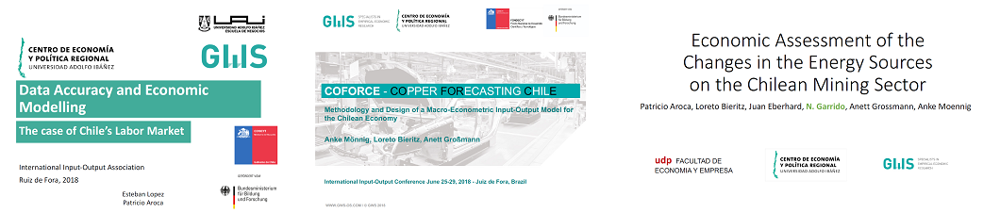

           
###   Noticias  

<html>
<body style=”text-align: justify;”>

####   La minería de cobre en Chile - ¿el motor de la economía chilena? 

# Investigadores del proyecto COFORCE presentan resultados de investigación en la 26th International Input-Output Conference (Junio 25-29, Brasil, Juiz de Fora)
 
En la conferencia "26th International Input-Output Conference" realizada en Brasil entre el 25 y 29 de Junio, Patricio Aroca, Anke Mönnig, Nicolás Garrido y Esteban López han presentado parte de los resultados de la investigación del proyecto COFORCE. En esta conferencia se discutió sobre los principales resultados del modelo a escala nacional y se plantean los desafíos para la regionalización del modelo. 

Revisa los resultados preliminares de la investigación del proyecto COFORCE:

...
<noscript>New Gallery 2018/7/23originaldate 1/1/0001 6:00:00 AMwidth 1089height 818originaldate 1/1/0001 6:00:00 AMwidth 1088height 817originaldate 1/1/0001 6:00:00 AMwidth 1090height 817originaldate 1/1/0001 6:00:00 AMwidth 1090height 816originaldate 1/1/0001 6:00:00 AMwidth 1089height 815originaldate 1/1/0001 6:00:00 AMwidth 1091height 818originaldate 1/1/0001 6:00:00 AMwidth 1090height 817originaldate 1/1/0001 6:00:00 AMwidth 1089height 816originaldate 1/1/0001 6:00:00 AMwidth 1092height 817originaldate 1/1/0001 6:00:00 AMwidth 1088height 817originaldate 1/1/0001 6:00:00 AMwidth 1088height 815originaldate 1/1/0001 6:00:00 AMwidth 1086height 818originaldate 1/1/0001 6:00:00 AMwidth 1085height 817originaldate 1/1/0001 6:00:00 AMwidth 1089height 818originaldate 1/1/0001 6:00:00 AMwidth 1086height 817originaldate 1/1/0001 6:00:00 AMwidth 1088height 814originaldate 1/1/0001 6:00:00 AMwidth 1091height 818originaldate 1/1/0001 6:00:00 AMwidth 1089height 817originaldate 1/1/0001 6:00:00 AMwidth 1088height 815originaldate 1/1/0001 6:00:00 AMwidth 1086height 814originaldate 1/1/0001 6:00:00 AMwidth 1091height 815originaldate 1/1/0001 6:00:00 AMwidth 1088height 815originaldate 1/1/0001 6:00:00 AMwidth 1088height 816originaldate 1/1/0001 6:00:00 AMwidth 1088height 815originaldate 1/1/0001 6:00:00 AMwidth 1088height 815originaldate 1/1/0001 6:00:00 AMwidth 1085height 817</noscript>

# Primeros resultados del modelo basado en Input-Output COFORCE

 Durante el <a href="http://www.gws-os.com/de/index.php/the-gws/io-workshop-overview/input-output-workshop-2018.html">taller de Input-Output </a> que tuvo lugar en Bremen del 15 al 16 de marzo del 2018, Loreto Bieritz presentó los primeros resultados del proyecto "Development of Sustainable Mining Strategies in Chile with a Regionalized National Model (BMBF FKZ: 01DN16030)". En ese proyecto se analiza la relevancia del sector minero para la economía chilena. En su presentación, la Sra. Bieritz dio una breve introducción al modelo <a href="http://www.gws-os.com/de/index.php/economic-and-social-affairs/models/model-details/coforce.html">COFORCE </a> e ilustró la producción, el empleo, la productividad y el valor agregado en cada sector económico en su desarrollo presente y futuro. Sobre la base de un análisis detallado del sector minero chileno, explicó que la minería del cobre juega un papel clave y cuáles son las ventajas y desventajas que resultan de ellos para la economía chilena.

  Puede bajar la presentación  <a href="http://www.gws-os.com/downloads/Bieritz_I-O-Workshop2018.pdf"> aquí </a> 

- <a href="index.html"> Volver al Índice </a>

</body>
</html>