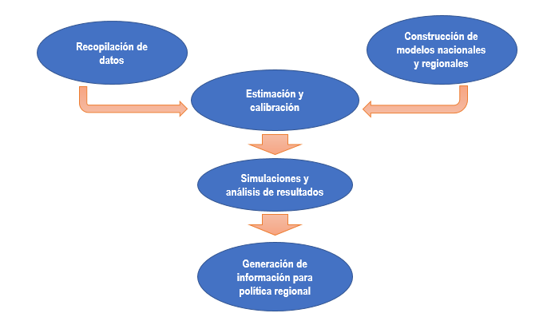

 

###  Sobre el Proyecto BMBF 

BMBF corresponde a un proyecto de investigación colaborativa, financiado por CONICYT, que tiene como eje principal de interés la generación de información relevante para la implementación de políticas públicas relacionadas al sector minero. Este proyecto se encuentra patrocinado actualmente por la Universidad Adolfo Ibáñez y la Institution of Economics Structures Research, además de tener investigadores asociados a la Universidad Diego Portales.

Los principales objetivos del proyecto son:

- Desarrollo de un modelo insumo producto regional

- Presentación de instrumental útil para discusión de políticas regionales 

En relación al modelo, el equipo se utilizará un modelo de equilibrio general computable que relacionará a los principares actores de la economía nacional: los hogares, mercado de capitales, empresas y gobierno. 

 

El proyecto BMBF corresponde a un proyecto de 3 años en los que tanto el equipo alemán y el equipo chileno se han designado tareas como la recopilación de bases de datos, calibración de modelos y análisis de resultados de escenarios propuestos.

 

Durante el año 2017 los equipos de investigación han desarrollado las bases de datos a utilizar junto con el desarrollo de los modelos nacionales y regionales. Los años posteriores, en un trabajo en conjunto, se espera presentar los análisis de diferentes simulaciones con las respectivas implicancias de política nacional y regional.

 

