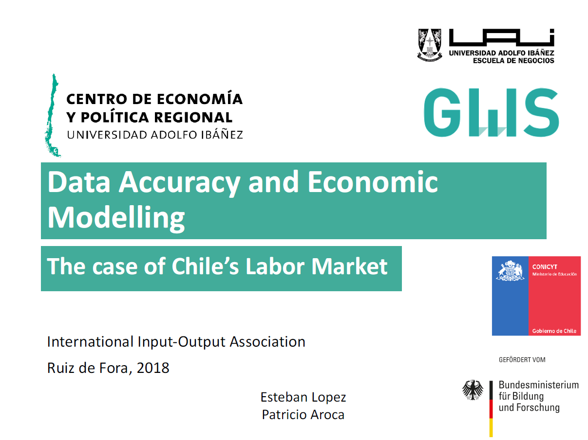

           
###   Resultados Preliminares 

<html>
<body style=”text-align: justify;”>

 A través del desarrollo de un modelo que permitirá analizar los alcances de shocks de precios internos y externos sobre el sector minero, tanto a nivel nacional como espacial, este proyecto busca generar información relevante para la discusión y elaboración de políticas públicas enfocadas especialmente en las evaluaciones de impacto de políticas aplicadas al sector minero. 

 Uno de los principales aportes que espera entregar estre proyecto es el desarrollo de un nuevo instrumental, conocido como los modelo REIM (Regional Econometrics Input Output Models), que permite desarrollar evaluaciones de impacto de shocks en variables económicas tanto a nivel nacional como nivel regional. Esto permitirá mejorar los alcances de información de hacedores de políticas públicas limitados para el análisis espacial con los REIM. 
   

  

Mira los resultados del proyecto COFORCE aquí:
 
- <strong> General Model: </strong>

Methodology and design of a macro-econometric input-output model for the Chilean economy

- <strong> Tax Scenarios:  </strong>

- <strong> Labor Data:  </strong>

Data accuracy and economic modelling

- <strong> Energy Scenario: </strong>

Economic asssessment of the changes in the energy sources on the chilean mining sector

</body>
</html>